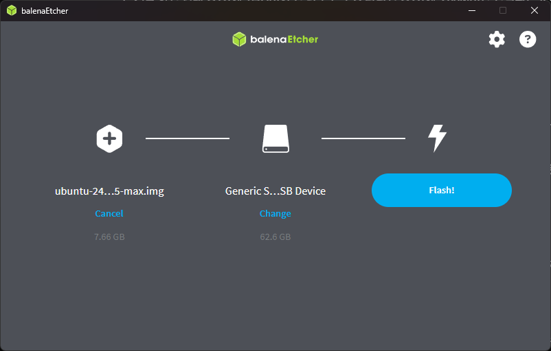
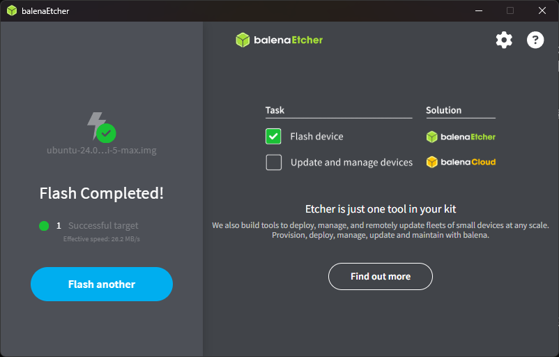
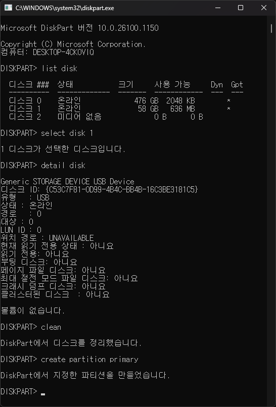

# 01. Orange Pi 5 Max OS 설치

## 문서 안내

| 항목 | 내용 |
|---|---|
| **커리큘럼** | **1 / 4** — OS 설치 |
| **선행** | 없음 ([00_INDEX.md](00_INDEX.md) 준비물 확인) |
| **작업 위치** | **Windows PC**(Etcher) + **Orange Pi**(HDMI·터미널) |
| **완료 기준** | OS 부팅, apt·기본 패키지, **`cma=256M`** |
| **다음** | [02_SSH_연결_및_설정.md](02_SSH_연결_및_설정.md) |

| 이 문서에서 함 | 이 문서에서 하지 않음 |
|---|---|
| SD 굽기, 첫 부팅, Desktop 마법사, apt, CMA, diskpart | SSH, IP 원격 접속, NPU, 카메라 테스트 |

### 작업 흐름

```text
[Windows] 이미지 다운로드 → Etcher 굽기 (§4~5)
    → [Pi] 첫 부팅·마법사 (§6)
    → [Pi] apt·패키지·CMA (§7~8)
    → [02] SSH 설정
```

---

## 1. 목적

**비어 있는 microSD**에 Ubuntu Rockchip OS를 처음부터 설치하고, 첫 부팅·기본 패키지·영상 처리용 CMA까지 적용한다.

## 2. 시작 상태

| 항목 | 이 단계 시작 시 |
|---|---|
| emmc/microSD | **포맷되지 않았거나 비어 있음** |
| Orange Pi | OS 없음, 전원 OFF |
| 네트워크/SSH/DX-M1 | **아직 해당 없음** |

## 3. 준비물

| 항목 | 설명 |
|---|---|
| Orange Pi 5 Max | 5V/4A 이상 전원 |
| emmc/microSD | 32GB 이상, **데이터 백업 후 사용** (굽기 시 전체 삭제됨) |
| USB SD 카드 리더 + emmc to sd(emmc 사용시) | Windows PC |
| HDMI + USB 키보드 | Desktop: 설정 마법사 / Server: 콘솔 로그인 |
| LAN 케이블/wifi ant | DHCP로 IP 받기 |

## 4. OS 이미지 다운로드

Orange Pi 5 Max / RK3588용 이미지:

| 항목 | 내용 |
|---|---|
| **릴리스** | [Ubuntu Rockchip v2.4.0](https://github.com/Joshua-Riek/ubuntu-rockchip/releases/tag/v2.4.0) |
| 저장소 | [Download](https://joshua-riek.github.io/ubuntu-rockchip-download/) |
|권장 버전| ubuntu 24.04|
|권장 옵션| Desktop-arm64|
| 보드 | 릴리스 페이지에서 **Orange Pi 5 Max** 항목 선택 |
| 형식 | `.img.xz` (압축) 또는 `.img` |

Desktop / Server 중 하나를 선택한다. Server는 콘솔·headless에 적합하고, Desktop은 HDMI 마법사로 초기 설정한다.

## 5. 이미지 굽기 (Windows PC)

### 5.1 balenaEtcher

1. [balenaEtcher](https://etcher.balena.io/) 설치
2. **Flash from file** → 다운로드한 `.img.xz` 또는 `.img`
3. **Select target** → microSD (용량·장치명 확인 — PC 디스크 선택 금지)
4. **Flash!** → 완료 후 SD 분리

**Flash 전** — 이미지 파일·대상 SD 확인:



**Flash 완료** — `Flash Completed!` 확인 후 SD 분리:



### 5.2 주의

- 굽기는 SD **전체를 덮어쓴다**. 기존 데이터는 복구 불가.
- 불량·저속 SD는 부팅 실패 원인이 될 수 있다.

## 6. 첫 부팅

1. emmc 장착 or microSD 삽입
2. HDMI, 키보드, **LAN** 연결
3. 전원 ON → 1~3분 대기

### 6.1 Ubuntu Server

| 항목 | 초기값 |
|---|---|
| 사용자 | `ubuntu` |
| 비밀번호 | `ubuntu` (첫 로그인 후 변경 권장) |

HDMI·시리얼로 로그인한다.

### 6.2 Ubuntu Desktop — 첫 부팅 설정 마법사

HDMI 모니터·USB 키보드·마우스를 연결한 뒤 전원을 켜면 **설정 마법사(Welcome / OOBE)** 가 순서대로 나온다. 아래 순서대로 진행한다.

| 순서 | 화면 | 입력·선택 | 교육용 권장 |
|---|---|---|---|
| **1** | **언어 선택** | 표시·입력 언어 | **한국어** (또는 English) |
| **2** | **키보드 레이아웃** | 키보드 종류·레이아웃 | **Korean** / **English (US)** |
| **3** | **Wi-Fi 연결** | 무선 네트워크 선택·비밀번호 | 사용할 Wi-Fi 선택 (유선 LAN만 쓸 경우 **건너뛰기** 가능) |
| **4** | **시스템 위치(시간)** | 지역·시간대 | **Seoul** / **Asia/Seoul** (한국 시간) |
| **5** | **사용자 정보** | 아래 항목 입력 | 마법사에서 설정한 계정·비밀번호 기억 |

#### 5단계 — 사용자 정보 항목

| 항목 | 설명 | 교육용 예시 |
|---|---|---|
| **이름(Your name)** | 화면에 표시되는 이름 | `Orange Pi User` |
| **컴퓨터 이름(Computer name)** | 네트워크·호스트 이름 | `orangepi5max` |
| **사용자 이름(Username)** | 로그인·sudo 계정 | `ubuntu` 또는 `devuser` |
| **패스워드(Password)** | 로그인·sudo 비밀번호 | **기억할 수 있는 값** |
| **자동 로그인(Automatic login)** | 부팅 시 비밀번호 없이 로그인 | 교육·개발: **켜기** / 보안: **끄기** |

마법사 완료 후 데스크톱이 나오면 **터미널**을 열고 **7절**로 진행한다.

**참고**

- 7.2 시간대·7.4 호스트 이름은 마법사(4·5단계)에서 이미 설정했으면 **중복 실행 생략** 가능.

## 7. 최초 시스템 설정

로그인 후 터미널에서 **순서대로** 실행한다.

### 7.1 패키지 업데이트

```bash
sudo apt update
sudo apt upgrade -y
```

### 7.2 시간대

마법사 4단계(시스템 위치)에서 **Seoul**을 선택했다면 생략 가능.

```bash
sudo timedatectl set-timezone Asia/Seoul
timedatectl
```

### 7.3 기본 도구 (이후 단계용)

```bash
sudo apt install -y git curl wget build-essential pkg-config \
  v4l-utils ffmpeg \
  gstreamer1.0-tools gstreamer1.0-plugins-base gstreamer1.0-plugins-good \
  gstreamer1.0-plugins-bad gstreamer1.0-rtsp
```

03·04번에서 다시 설치해도 되지만, 한 번에 받아 두면 네트워크 설정이 단순해진다.

### 7.4 호스트 이름 (선택)

마법사 5단계 **컴퓨터 이름**을 `orangepi5max` 등으로 설정했다면 생략 가능.

```bash
sudo hostnamectl set-hostname orangepi5max
hostname
```

## 8. CMA 부팅 파라미터 (cma=256M)

카메라·HDMI·DMA는 **연속 물리 메모리(CMA)** 가 필요하다. 클린 설치 직후 기본값(약 8MB)은 부족하다.

### 8.1 부팅 설정 파일 찾기

보드/이미지에 따라 경로가 다르다. 아래 중 존재하는 파일을 연다.

```bash
ls -la /boot/extlinux/extlinux.conf 2>/dev/null
ls -la /boot/firmware/cmdline.txt 2>/dev/null
ls -la /boot/firmware/extlinux/extlinux.conf 2>/dev/null
```

### 8.2 extlinux.conf 인 경우

```bash
sudo nano /boot/extlinux/extlinux.conf
```

`append` 줄 **끝**에 공백 후 `cma=256M` 추가:

```text
append root=UUID=... rootwait rw ... cma=256M
```

### 8.3 cmdline.txt 인 경우

```bash
sudo nano /boot/firmware/cmdline.txt
```

한 줄 끝에 `cma=256M` 추가 (기존 내용 뒤 공백 구분).

### 8.4 적용

```bash
sudo reboot
```

재부팅 후 확인:

```bash
cat /proc/meminfo | grep -i Cma
cat /proc/cmdline
```

정상 예:

```text
CmaTotal:         262144 kB
... cma=256M ...
```

## 9. 작업용 계정 (선택)

이미지 기본 `ubuntu` 계정만으로도 02~04번을 진행할 수 있다. 별도 계정이 필요하면 **새로 생성**한다 (기존 장비에서 복사하지 않음).

```bash
sudo adduser devuser
sudo usermod -aG sudo,video,plugdev,render devuser
```

이후 문서의 `<USER>`를 `ubuntu` 또는 `devuser`로 바꾼다.

## 10. 트러블슈팅

| 증상 | 조치 |
|---|---|
| 부팅 안 됨 | SD 재굽기, 다른 SD·리더, 전원 5V/4A 확인 |
| 화면 없음 | HDMI·케이블 교체, 2~3분 추가 대기 |
| IP 없음 | LAN 연결, `ip link`, 공유기 DHCP 목록 확인 |
| CMA 미적용 | 부팅 설정 파일 경로 재확인, `sudo reboot` |
| **eMMC→SD / SD PC 미인식** | **10.1절 diskpart** 후 Etcher 재굽기 |

백업 등 **기존 장비 복구**는 [OrangePI_전체시스템_백업_복구_방법.md](../OrangePI_전체시스템_백업_복구_방법.md) 참조.

### 10.1 eMMC → SD / SD 카드 PC·Etcher 미인식 (diskpart)

**eMMC 내용을 SD로 옮겼거나**, SD를 Orange Pi에서 쓰다 PC에 다시 꽂았을 때 **탐색기·Etcher에 안 보이거나** 이상한 파티션만 보일 때 Windows **diskpart**로 SD를 초기화한다.

**주의**

- SD **전체 데이터가 삭제**된다.
- `select disk` 번호를 잘못 고르면 **Windows(C:) 디스크**를 지울 수 있다. **용량(MB/GB)** 으로 SD만 고른다.
- diskpart 후 **5절 balenaEtcher**로 OS `.img`를 **다시 굽는다** (exFAT 포맷만으로는 부팅 OS가 되지 않음).

#### 절차

1. Windows 검색 → **cmd** → **관리자 권한**으로 명령 프롬프트 실행

2. diskpart 실행:

```cmd
diskpart
```

3. 연결된 디스크 목록 확인 (**용량**으로 SD 번호 확인):

```cmd
list disk
```

예시:

```text
  디스크 0    ...  500 GB   (PC 내장 SSD — 선택 금지)
  디스크 1    ...   64 GB   (microSD — 이 번호 선택)
```

4. SD 디스크 선택 (번호는 본인 환경에 맞게 변경):

```cmd
select disk 1
```

5. 파티션·데이터 삭제:

```cmd
clean
```

6. 주 파티션 생성:

```cmd
create partition primary
```

`list disk` → `select disk` → `clean` → `create partition primary`까지의 화면 예:



7. exFAT 빠른 포맷 (Windows·Mac 호환, 탐색기 표시용):

```cmd
format fs=exfat quick
```

8. 드라이브 문자 할당:

```cmd
assign
```

9. diskpart 종료:

```cmd
exit
```

10. 탐색기에서 SD가 보이는지 확인 → **5절 balenaEtcher**로 Ubuntu Rockchip `.img` / `.img.xz` **재굽기**

#### diskpart 한 번에 (참고)

`select disk` 번호만 본인 SD에 맞게 바꾼 뒤 순서대로 실행:

```cmd
diskpart
list disk
select disk 1
clean
create partition primary
format fs=exfat quick
assign
exit
```

#### 여전히 인식 안 될 때

| 확인 | 조치 |
|---|---|
| USB 리더·SD 접점 | 다른 리더·포트, SD 재삽입 |
| SD 불량 | 다른 SD 카드로 테스트 |
| Etcher 대상 | **Select target**에서 용량·장치명 재확인 |
| Orange Pi 부팅 | SD 삽입 깊이, 전원 OFF 후 재삽입 |

## 11. 완료 확인

- [ ] 빈 SD에 OS 굽기·첫 부팅
- [ ] (Desktop) 6.2절 설정 마법사 1~5단계 완료
- [ ] `sudo apt update && sudo apt upgrade` 완료
- [ ] `git`, `build-essential` 설치
- [ ] `/proc/cmdline`에 `cma=256M`, `CmaTotal` 약 256MB

## 12. 관련 링크

| 분류 | URL |
|---|---|
| OS | https://github.com/Joshua-Riek/ubuntu-rockchip/releases/tag/v2.4.0 |
| Tools | https://etcher.balena.io/ |

## 13. 다음 단계

→ [02_SSH_연결_및_설정.md](02_SSH_연결_및_설정.md) — **02번부터는 Windows SSH 준비가 먼저**입니다.
