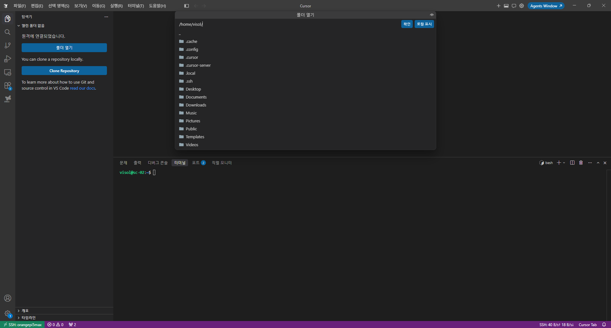

# 02. SSH 연결 및 설정

## 문서 안내

| 항목 | 내용 |
|---|---|
| **커리큘럼** | **2 / 4** — SSH 원격 접속 |
| **선행** | [01_OrangePi5Max_OS_설치.md](01_OrangePi5Max_OS_설치.md) 완료 (Pi 부팅·LAN) |
| **작업 위치** | **Windows PC**(PowerShell·VS Code) + **Orange Pi**(SSH·HDMI) |
| **완료 기준** | Windows 키 생성 → Pi `openssh-server` → **키 접속** |
| **다음** | [03_DX-M1_NPU_드라이버_설치_및_테스트.md](03_DX-M1_NPU_드라이버_설치_및_테스트.md) |

| 이 문서에서 함 | 이 문서에서 하지 않음 |
|---|---|
| OpenSSH·키·IP·ssh 서버·authorized_keys·VS Code·SCP | OS 굽기, dx-all-suite, NPU, 카메라 |

### 작업 흐름 (순서 필수)

```text
[Windows §4~5] OpenSSH Client → ssh-keygen
    → [Pi §6] IP 확인 (hostname -I)
    → [Windows §7] ssh 비밀번호 1회
    → [Pi §8] openssh-server
    → [Windows §9~10] 공개키 등록·키 접속
    → [선택 §11~14] VS Code·SCP·보안
```

---

## 1. 목적

01번에서 부팅한 Orange Pi에 **IP 주소로 원격 접속**할 수 있게 한다. **Windows PowerShell OpenSSH 설치·키 생성을 먼저** 한 뒤, IP 확인·Orange Pi SSH 서버 설치·키 등록·VS Code Remote-SSH·SCP까지 구성한다.

## 2. 시작 상태

| 항목 | 이 단계 시작 시 |
|---|---|
| OS | 01번 완료 (Ubuntu Rockchip 부팅·LAN 연결) |
| Orange Pi IP | **아직 모름** (확인 필요) |
| SSH 서버 | **미설치 또는 미확인** |
| SSH 키 | Windows·Orange Pi 모두 **없음** |

### 2.1 OS 이미지별 SSH 상태

| 이미지 | SSH 서버 | 첫 접속 방법 |
|---|---|---|
| **Ubuntu Server** | 보통 **openssh-server 포함·기동** | PowerShell에서 IP로 바로 `ssh` 가능 |
| **Ubuntu Desktop** | 기본 **미설치**일 수 있음 | HDMI로 1회 로그인 → SSH 설치 → IP 접속 |

## 3. 사전 조건

- [01](01_OrangePi5Max_OS_설치.md) 완료
- Orange Pi와 Windows PC **같은 LAN**
- `<USER>`: Server `ubuntu` / Desktop 마법사 사용자명

저장소 `ssh_keys/`는 **다른 PC용 예시**이며, 이 교육에서는 Windows에서 **새 키를 생성**한다.

---

## A. Windows 준비 (Pi IP 몰라도 됨)

## 4. Windows — OpenSSH Client 설치

Orange Pi에 접속하기 전, Windows PC에서 **OpenSSH Client**를 준비한다.

PowerShell (**관리자**):

```powershell
Get-WindowsCapability -Online | Where-Object Name -like 'OpenSSH.Client*'
```

`State : NotPresent`이면 설치:

```powershell
Add-WindowsCapability -Online -Name OpenSSH.Client~~~~0.0.1.0
```

설치 확인:

```powershell
ssh -V
```

`OpenSSH_for_Windows_...` 버전 문자열이 나오면 준비 완료.

## 5. Windows — SSH 키 생성

Orange Pi IP를 아직 모르더라도 **키는 미리 생성**해 둔다.

PowerShell:

```powershell
ssh-keygen -t ed25519 -f "$env:USERPROFILE\.ssh\id_ed25519_orangepi" -C "<USER>@orangepi5max"
```

예 (Server, 사용자 `ubuntu`):

```powershell
ssh-keygen -t ed25519 -f "$env:USERPROFILE\.ssh\id_ed25519_orangepi" -C "ubuntu@orangepi5max"
```

프롬프트에서 **passphrase**는 Enter(비움) 또는 원하는 값.

### 5.1 `-C` 옵션 설명

| 항목 | 설명 |
|---|---|
| `-C` | 공개키 **끝에 붙는 주석(메모)**. 접속 주소로 쓰이지 **않음** |
| 실제 접속 IP | `ssh <USER>@<ORANGE_PI_IP>` 또는 config의 `HostName` |

`-C`에는 **어느 장비용 키인지** 구분하기 쉬운 문자열을 넣는다. IP를 알게 되면 같은 문자열을 IP로 바꿔 적어도 되고, 호스트 이름(`orangepi5max`)을 그대로 둬도 동작에는 차이 없다.

공개키 확인:

```powershell
Get-Content "$env:USERPROFILE\.ssh\id_ed25519_orangepi.pub"
```

`.pub` 한 줄 **맨 끝**에 `ubuntu@orangepi5max` 같은 주석이 붙어 있으면 정상이다.

---

## B. Orange Pi IP · 첫 접속

## 6. Orange Pi IP 주소 확인

PowerShell에서 `ssh <USER>@<IP>` 접속하려면 Orange Pi의 **LAN IP**(예: `192.168.0.42`)가 필요하다.

### 6.1 Orange Pi에서 직접 확인 (HDMI, 가장 확실)

Orange Pi 로컬 터미널:

```bash
hostname -I
ip -4 addr show
```

첫 번째 주소(보통 `192.168.x.x`)를 메모 → `<ORANGE_PI_IP>`

### 6.2 공유기 DHCP 목록

공유기 관리 페이지 → 연결된 장치 / DHCP Client 목록에서 Orange Pi(또는 `ubuntu`, MAC 주소) 항목의 IP 확인.

### 6.3 Windows PowerShell에서 연결 테스트

IP를 알았으면:

```powershell
ping <ORANGE_PI_IP>
Test-NetConnection <ORANGE_PI_IP> -Port 22
```

응답이 없으면 LAN 케이블·공유기·Orange Pi 전원을 확인한다.

## 7. Windows — IP로 첫 접속 (비밀번호 로그인)

PowerShell:

```powershell
ssh <USER>@<ORANGE_PI_IP>
```

예 (Ubuntu Server):

```powershell
ssh ubuntu@192.168.0.42
```

| 항목 | 값 |
|---|---|
| `<USER>` | Server: `ubuntu` / Desktop: 설정한 사용자 |
| `<ORANGE_PI_IP>` | 6절에서 확인한 IP |
| 비밀번호 | Server: `ubuntu` (변경 권장) / Desktop: 설정한 비밀번호 |

최초 접속:

```text
Are you sure you want to continue connecting (yes/no/[fingerprint])? yes
```

비밀번호 입력 후 프롬프트가 Orange Pi(`ubuntu@...`)이면 **IP 로그인 성공**.

```powershell
exit
```

### 7.1 Connection refused 일 때

SSH 서버가 없거나 꺼져 있다. **8절**로 HDMI 또는 원격으로 `openssh-server`를 설치한다.

---

## C. Orange Pi SSH 서버 · 키 등록

## 8. Orange Pi — SSH 서버 설치

### 8.1 경로 A: IP 접속이 이미 되는 경우 (Server 이미지 등)

PowerShell에서 접속한 뒤 Orange Pi 셸에서:

```bash
sudo apt update
sudo apt install -y openssh-server
sudo systemctl enable --now ssh
sudo systemctl status ssh
sudo ss -lntp | grep :22
```

이미 동작 중이면 `status`만 확인하고 9절로 진행.

### 8.2 경로 B: IP 접속이 안 되는 경우 (Desktop, SSH 미설치)

Orange Pi **HDMI + 키보드**로 로컬 로그인 후:

```bash
sudo apt update
sudo apt install -y openssh-server
sudo systemctl enable --now ssh
hostname -I
```

설치 후 PowerShell에서 **7절** IP 접속을 재시도:

```powershell
ssh ubuntu@192.168.0.42
```

### 8.3 방화벽 (해당 시)

```bash
sudo ufw allow 22/tcp
sudo ufw status
```

## 9. 공개키 등록 (IP 접속)

비밀번호 로그인이 되는 상태에서 PowerShell:

```powershell
type "$env:USERPROFILE\.ssh\id_ed25519_orangepi.pub" | ssh <USER>@<ORANGE_PI_IP> "mkdir -p ~/.ssh && chmod 700 ~/.ssh && cat >> ~/.ssh/authorized_keys && chmod 600 ~/.ssh/authorized_keys"
```

### 수동 등록 (HDMI)

Orange Pi에서:

```bash
mkdir -p ~/.ssh && chmod 700 ~/.ssh
nano ~/.ssh/authorized_keys
# Windows .pub 내용을 한 줄로 붙여넣기
chmod 600 ~/.ssh/authorized_keys
```

## 10. 키 기반 IP 접속 확인

```powershell
ssh -i "$env:USERPROFILE\.ssh\id_ed25519_orangepi" <USER>@<ORANGE_PI_IP>
```

비밀번호 없이 접속되면 성공.

---

## D. 편의 기능 (선택)

## 11. Windows SSH config (선택)

`%USERPROFILE%\.ssh\config`:

```text
Host orangepi5max
    HostName <ORANGE_PI_IP>
    User <USER>
    IdentityFile ~/.ssh/id_ed25519_orangepi
    IdentitiesOnly yes
```

```powershell
ssh orangepi5max
```

## 12. VS Code Remote-SSH 연결

PowerShell `ssh` 접속이 되면, **VS Code**에서 Orange Pi 파일을 열고 터미널·편집을 원격으로 할 수 있다. 03·04번 작업을 PC 화면에서 이어가기에 편하다.

### 12.1 사전 조건

- **10절** 키 접속 또는 **7절** 비밀번호 접속이 이미 성공한 상태
- Windows PC에 [VS Code](https://code.visualstudio.com/) 설치
- **11절** `~/.ssh/config`에 `Host orangepi5max` 항목 설정 (아래 예시)

### 12.2 확장 설치

1. VS Code 실행
2. 왼쪽 **Extensions**(Ctrl+Shift+X)
3. **Remote - SSH** 검색 → Microsoft **Remote - SSH** 설치
4. (권장) **Remote - SSH: Editing Configuration Files** 함께 설치

### 12.3 SSH config (VS Code용)

VS Code는 Windows의 `%USERPROFILE%\.ssh\config`를 읽는다. **11절**과 동일 파일에 아래를 넣는다.

`F1` → `Remote-SSH: Open SSH Configuration File` → `C:\Users\<Windows사용자>\.ssh\config` 선택:

```text
Host orangepi5max
    HostName 192.168.0.42
    User ubuntu
    IdentityFile C:/Users/<Windows사용자>/.ssh/id_ed25519_orangepi
    IdentitiesOnly yes
```

| 항목 | 값 |
|---|---|
| `HostName` | `<ORANGE_PI_IP>` (실제 IP) |
| `User` | `<USER>` (예: `ubuntu`) |
| `IdentityFile` | 5절에서 만든 **개인키** 경로 (슬래시 `/` 사용 권장) |

예:

```text
Host orangepi5max
    HostName 192.168.0.42
    User ubuntu
    IdentityFile C:/Users/ym720/.ssh/id_ed25519_orangepi
    IdentitiesOnly yes
```

### 12.4 VS Code에서 접속

**방법 A — 명령 팔레트**

1. `F1` (또는 Ctrl+Shift+P)
2. `Remote-SSH: Connect to Host...` 입력·선택
3. 목록에서 **`orangepi5max`** 선택
4. 새 VS Code 창이 열리며 연결 (키 등록 완료 시 비밀번호 없음)
5. **Open Folder** → `/home/ubuntu` (또는 `<USER>` 홈) 선택

원격 연결 후 **Open Folder**로 Pi 홈 디렉터리를 여는 화면 예 (VS Code / Cursor 동일):



**방법 B — 왼쪽 하단**

1. VS Code 왼쪽 하단 **><** (Remote) 아이콘 클릭
2. **Connect to Host...** → `orangepi5max`

### 12.5 연결 확인

새 창 왼쪽 하단에 **`SSH: orangepi5max`** 가 보이면 원격 연결 성공.

통합 터미널(Ctrl+`)`에서:

```bash
hostname -I
pwd
```

Orange Pi IP·홈 경로가 나오면 정상.

### 12.6 원격에서 자주 쓰는 작업

| 작업 | 방법 |
|---|---|
| 터미널 | Ctrl+` → Orange Pi 셸 |
| 파일 편집 | 탐색기에서 `/home/ubuntu/dx-all-suite` 등 열기 |
| 파일 업로드 | 탐색기에 Windows 파일 드래그 앤 드롭 |
| 연결 종료 | `F1` → `Remote-SSH: Close Remote Connection` |

### 12.7 VS Code 트러블슈팅

| 증상 | 조치 |
|---|---|
| Host 목록에 안 보임 | `config` 저장 경로·`Host` 이름 확인 |
| Permission denied | `IdentityFile` 경로, 9절 `authorized_keys` 재확인 |
| Could not establish connection | PowerShell `ssh orangepi5max` 먼저 성공하는지 확인 |
| IP 변경 후 실패 | `HostName`을 새 IP로 수정, `ssh-keygen -R <구IP>` |
| platform linux/arm64 경고 | Orange Pi(aarch64)는 정상; Remote 확장이 서버 쪽 VS Code Server 설치 |

## 13. mDNS (선택)

Orange Pi (SSH 접속 중):

```bash
sudo hostnamectl set-hostname orangepi5max
sudo apt install -y avahi-daemon
sudo systemctl enable --now avahi-daemon
```

PowerShell:

```powershell
ping orangepi5max.local
ssh -i "$env:USERPROFILE\.ssh\id_ed25519_orangepi" <USER>@orangepi5max.local
```


## 14. 파일 전송 (SCP)

### Windows → Orange Pi

```powershell
scp -i "$env:USERPROFILE\.ssh\id_ed25519_orangepi" .\local_file.txt <USER>@<ORANGE_PI_IP>:~/
```

### Orange Pi → Windows

```powershell
scp -i "$env:USERPROFILE\.ssh\id_ed25519_orangepi" <USER>@<ORANGE_PI_IP>:~/remote_file.txt .
```

## 15. 보안 강화 (키 등록 확인 후)

Orange Pi:

```bash
sudo nano /etc/ssh/sshd_config
```

```text
PasswordAuthentication no
PubkeyAuthentication yes
PermitRootLogin no
```

```bash
sudo systemctl restart ssh
```

**주의:** 키 접속을 먼저 확인한 뒤 비밀번호 로그인을 끈다.

## 16. 트러블슈팅

| 증상 | 조치 |
|---|---|
| `ssh` 명령 없음 | 4절 OpenSSH Client 설치 |
| Connection refused | 8절 openssh-server 설치, `systemctl status ssh` |
| IP를 모름 | 6.1 HDMI `hostname -I`, 6.2 공유기 DHCP |
| Permission denied (publickey) | `authorized_keys`, chmod 600, `-i` 키 경로 |
| Host key changed | `ssh-keygen -R <ORANGE_PI_IP>` |
| ping 안 됨 | LAN 케이블, 같은 공유기/Wi-Fi 대역 확인 |

## 17. 작업 흐름 요약

```text
[Windows] OpenSSH Client 설치 (4절)
       |
[Windows] ssh-keygen 키 생성 (5절)
       |
[Orange Pi] LAN 연결, IP 확인 (6절)
       |
[Windows] ssh <USER>@<IP> 비밀번호 로그인 (7절)
       |
[Orange Pi] openssh-server 설치·확인 (8절)
       |
[Windows] 공개키 등록 (9절)
       |
[Windows] ssh -i ... <USER>@<IP> 키 접속 (10절)
       |
[VS Code] Remote-SSH → orangepi5max → /home/ubuntu (12절)
```

## 18. 완료 확인

- [ ] Windows **OpenSSH Client** 설치 (`ssh -V` 확인)
- [ ] Windows **ed25519 키** 생성 (5절)
- [ ] `<ORANGE_PI_IP>` 확인
- [ ] PowerShell `ssh <USER>@<IP>` **비밀번호** 로그인 성공
- [ ] `openssh-server` 설치·22번 포트 리슨
- [ ] 공개키 등록·**키로 IP 접속** 및 `scp` 성공
- [ ] VS Code **Remote-SSH**로 `orangepi5max` 접속, `/home/ubuntu` 폴더 열기

## 19. 다음 단계

→ [03_DX-M1_NPU_드라이버_설치_및_테스트.md](03_DX-M1_NPU_드라이버_설치_및_테스트.md): DeepX M1 장착 및 dx-all-suite 설치
