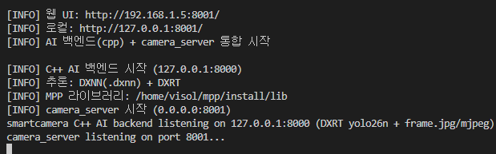

# 05. SmartCamera App 설치 및 실행

## 문서 안내

| 항목 | 내용 |
|---|---|
| **커리큘럼** | **5 / 5** — SmartCamera App (웹 UI·카메라·AI) |
| **선행** | [01](01_OrangePi5Max_OS_설치.md) **CMA 256M**, [02](02_SSH_연결_및_설정.md), [03](03_DX-M1_NPU_드라이버_설치_및_테스트.md) **dx-all-suite·dx_app**, [04](04_USB_UVC_카메라_테스트.md) **`test.jpg`** |
| **작업 위치** | Orange Pi (SSH 권장) |
| **완료 기준** | `./start.sh` 기동, 브라우저 **`http://<Pi-IP>:8001`** 접속, `curl` 상태 OK |
| **다음** | [00_INDEX.md](00_INDEX.md) §10 최종 점검 |

| 이 문서에서 함 | 이 문서에서 하지 않음 |
|---|---|
| [SmartCamera_App](https://github.com/VISOL-TechTeam/SmartCamera_App) clone, `Install.sh`, `./start.sh`, 웹 접속·종료 | OS·SSH·dx-all-suite 설치, UVC ffmpeg 상세 |

### 작업 흐름

```text
[§4] git clone SmartCamera_App
    → [§5] sudo ./Install.sh (최초 1회)
    → [§6] ./Install.sh --status 확인
    → [§7] ./start.sh (빌드 + 8000·8001 기동)
    → [§8] 브라우저·curl 검증
    → [§9] ./start.sh --stop (종료)
```

> **원칙:** [04](04_USB_UVC_카메라_테스트.md)에서 **카메라 단독** 검증을 통과한 뒤 이 문서를 진행한다. UVC와 NPU를 동시에 무리하게 점유하면 커널 hang이 날 수 있다 — 저장소 [AGENTS.md](https://github.com/VISOL-TechTeam/SmartCamera_App/blob/main/AGENTS.md) 안전 수칙을 따른다.

---

## 1. 목적

Orange Pi 5 Max에 **SmartCamera App**을 처음 설치하고, C++ 기본 모드(`camera_server` **8001** + `ai_backend` **8000**)로 웹 UI를 띄운다.

저장소: https://github.com/VISOL-TechTeam/SmartCamera_App

## 2. 시작 상태

| 항목 | 이 단계 시작 시 |
|---|---|
| SmartCamera_App | **없음** |
| `third_party/` (MediaMTX·RKNN) | **없음** (`Install.sh`가 생성) |
| `cpp/camera_server`, `cpp/ai_backend` | **미빌드** |
| 포트 8000·8001 | **미사용** |

## 3. 사전 조건

- [01](01_OrangePi5Max_OS_설치.md) — Ubuntu Rockchip, **`cma=256M`**
- [02](02_SSH_연결_및_설정.md) — SSH 접속 가능
- [03](03_DX-M1_NPU_드라이버_설치_및_테스트.md) — `dxrt-cli -s` M1 인식, **`~/dx-all-suite/dx-runtime/dx_app`** (또는 동등 경로) 존재
- [04](04_USB_UVC_카메라_테스트.md) — `/dev/video0` 인식, **`test.jpg`** 캡처 성공
- USB UVC 카메라 **연결 유지**
- 네트워크: LAN DHCP (브라우저 접속용 IP 확인 가능)

**dx_app 경로 확인** (`start.sh`·`make`가 자동 탐색):

```bash
test -f ~/dx-all-suite/dx-runtime/dx_app/src/cpp_example/common/utility/common_util.hpp \
  && echo "dx_app OK" || echo "dx_app 없음 — 03번 재확인"
```

---

## A. 저장소 받기

## 4. git clone

Orange Pi 홈 디렉터리 기준:

```bash
cd ~
git clone https://github.com/VISOL-TechTeam/SmartCamera_App.git
cd ~/SmartCamera_App
```

다른 경로에 clone해도 되나, 이후 명령은 **저장소 루트**에서 실행한다.

확인:

```bash
ls Install.sh start.sh cpp/Makefile
```

---

## B. 설치 (최초 1회)

## 5. 통합 설치 (`Install.sh`)

프로젝트 루트에서 **한 번** 실행한다. apt 패키지, `video` 그룹, 서드파티(MediaMTX·RKNN), sudoers(시간·네트워크 API)를 순서대로 처리한다.

```bash
cd ~/SmartCamera_App
sudo ./Install.sh
```

설치 내용 요약:

| 단계 | 내용 |
|---|---|
| scripts 권한 | `scripts/*.sh`, 루트 `*.sh` 실행 가능 |
| apt | `build-essential`, `libopencv-dev`, `pkg-config`, `v4l-utils`, `iputils-arping` |
| video 그룹 | 저장소 소유 사용자 추가 (UVC `/dev/video*`) |
| 서드파티 | `third_party/mediamtx`, `third_party/rknn` (git 미포함) |
| sudoers | 웹 UI 호스트명·시간·네트워크(NM) API용 NOPASSWD |

`video` 그룹 반영을 위해 **로그아웃 후 재접속**하거나 reboot를 권장한다.

```bash
groups
# video 가 보이면 OK
```

### 5.1 선택: 부팅 자동 시작

교육 세션에서는 생략해도 된다. 운영 장비에만:

```bash
sudo ./Install.sh --systemd
# 또는: sudo ./mount.sh --start
```

---

## C. 설치 상태·빌드

## 6. 설치 확인

```bash
cd ~/SmartCamera_App
./Install.sh --status
```

OpenCV·v4l2·third_party·sudoers 항목이 OK인지 확인한다.

수동으로 패키지만 다시 설치할 때:

```bash
sudo apt-get install -y build-essential libopencv-dev pkg-config v4l-utils iputils-arping
./scripts/install_third_party.sh
```

---

## D. 실행

## 7. 통합 시작 (`start.sh`)

C++ 기본 모드: **빌드(`make -C cpp`) 후** AI 백엔드(8000)와 camera_server(8001)를 함께 기동한다.

```bash
cd ~/SmartCamera_App
./start.sh
```

정상 시 출력 예:

```text
[INFO] DX-APP: /home/ubuntu/dx-all-suite/dx-runtime/dx_app
[INFO] C++ 빌드: make -C cpp ai_backend camera_server
[INFO] 웹 UI: http://<Pi-IP>:8001/
[INFO] camera_server 시작 (0.0.0.0:8001)
smartcamera C++ AI backend listening on 127.0.0.1:8000 (DXRT yolo26n + frame.jpg/mjpeg)
camera_server listening on port 8001...
```

실행 화면 예:



**dx_app을 다른 경로에 둔 경우:**

```bash
SMARTCAMERA_DX_APP_DIR=/path/to/dx_app ./start.sh
```

**AI 모델(.dxnn) 경로** — [03 §12](03_DX-M1_NPU_드라이버_설치_및_테스트.md) dx_stream 설치 후 자동 탐색된다. 수동 지정:

```bash
export SMARTCAMERA_AI_MODEL_DIR=~/dx-all-suite/dx-runtime/dx_stream/dx_stream/samples/models
./start.sh
```

### 7.1 포트·프로세스

| 포트 | 프로세스 | 역할 |
|:---:|:---:|---|
| **8001** | `cpp/camera_server` | 웹 UI, 카메라·시스템 API (브라우저는 **여기만** 접속) |
| **8000** | `cpp/ai_backend` | AI 추론 (8001이 `/api/ai/*` 프록시) |

디버그용 단독 실행:

```bash
make -C cpp run      # camera_server(8001)만
make -C cpp run-ai   # ai_backend(8000)만
```

---

## E. 동작 확인

## 8. 브라우저·API

Pi IP 확인:

```bash
hostname -I
```

**같은 LAN의 PC 브라우저:**

```text
http://<Orange-Pi-IP>:8001/
```

Pi 로컬:

```bash
curl -s --max-time 3 http://127.0.0.1:8001/api/status | head -c 200
curl -s --max-time 3 http://127.0.0.1:8000/api/ai/pipeline/status
```

웹 UI에서 확인할 항목:

- **AI** 페이지 — 카메라 미리보기(MJPEG)
- **설정** — 카메라 포맷, UVC 옵션
- (선택) AI 파이프라인 — 모델 선택·시작·중지 (**반드시 `--max-time` 있는 curl/API 순서** — 아래 §10)

---

## F. 종료·트러블슈팅

## 9. 종료

포그라운드 `./start.sh` 실행 중: **Ctrl+C**.

별도 터미널에서:

```bash
cd ~/SmartCamera_App
./start.sh --stop
```

프로세스·포트 확인:

```bash
ss -lntp | grep -E '8000|8001'
sudo fuser -v /dev/video0
```

## 10. AI API 안전 순서

UVC·NPU 동시 점유로 hang이 날 수 있다. AI 테스트는 아래 순서만 사용한다.

```bash
curl -s --max-time 3  http://127.0.0.1:8000/api/ai/pipeline/status
curl -s --max-time 5  http://127.0.0.1:8000/api/ai/models
curl -s --max-time 25 -X POST http://127.0.0.1:8000/api/ai/pipeline/start \
  -H 'Content-Type: application/json' -d '{"model_name":"yolo26n.dxnn"}'
curl -s --max-time 15 -X POST http://127.0.0.1:8000/api/ai/pipeline/stop \
  -H 'Content-Type: application/json' -d '{}'
```

스모크 테스트:

```bash
./scripts/test_ai_pipeline.sh
```

## 11. 자주 나는 문제

| 증상 | 조치 |
|---|---|
| `DX-APP 소스 경로를 찾을 수 없습니다` | [03](03_DX-M1_NPU_드라이버_설치_및_테스트.md) dx-all-suite clone·install 확인, `SMARTCAMERA_DX_APP_DIR` 지정 |
| `cannot find -lNori_Xvision_Std` | `cpp/Nori_Xvision_Development_Kit_*` 포함 여부 확인, `make -C cpp clean && make -C cpp` |
| `permission denied` on `./start.sh` | `chmod +x start.sh` 또는 `sudo ./Install.sh --scripts-only` |
| `/dev/video0` 점유 | `./start.sh --stop`, PipeWire 중지([04 §12](04_USB_UVC_카메라_테스트.md)), reboot |
| Camera timeout·HDMI 초록 화면 | [04](04_USB_UVC_카메라_테스트.md) CMA 256M·ffmpeg 단독 테스트 선행 |
| `:8001` 연결 거부 | `./start.sh` 재실행, `ss -lntp \| grep 8001` |
| AI 모델 없음 | [03 §12](03_DX-M1_NPU_드라이버_설치_및_테스트.md) dx_stream 또는 `SMARTCAMERA_AI_MODEL_DIR` |
| sudoers·네트워크 UI 비활성 | `sudo ./scripts/install_sudoers.sh` |

멈춤·hang 의심 시: **새 `pipeline/start` 호출 금지** → `./start.sh --stop` → 필요 시 **reboot**.

---

## 12. 완료 확인

- [ ] `~/SmartCamera_App` clone 완료
- [ ] `sudo ./Install.sh` 및 `./Install.sh --status` OK
- [ ] `./start.sh` — `camera_server` 8001 LISTEN
- [ ] 브라우저 `http://<Pi-IP>:8001/` 접속
- [ ] `curl http://127.0.0.1:8001/api/status` 응답
- [ ] `./start.sh --stop`으로 정상 종료

---

## 13. 교육 커리큘럼 완료

→ [00_INDEX.md](00_INDEX.md) **§10 최종 점검** 체크리스트로 01~05 전체 확인.

**심화 문서**

| 주제 | 문서 |
|---|---|
| SmartCamera 운영·환경 변수 | [SmartCamera_App OPERATIONS.md](https://github.com/VISOL-TechTeam/SmartCamera_App/blob/main/OPERATIONS.md) |
| UVC/NPU 안전 수칙 | [SmartCamera_App AGENTS.md](https://github.com/VISOL-TechTeam/SmartCamera_App/blob/main/AGENTS.md) |
| 전체 파이프라인 | [RK3588_DeepX_M1_스마트카메라_데이터파이프라인.md](../RK3588_DeepX_M1_스마트카메라_데이터파이프라인.md) |
